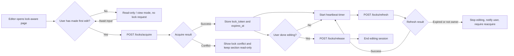
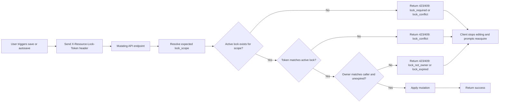

# Engagement and Survey Locking Design

## Purpose

Implement a locking model for Engagement and Survey editing that avoids race conditions and conflicting writes while allowing multiple users to view and edit the same resource without interference.

Design goals:

- Prevent conflicting writes by two users to the same editable scope.
- Avoid taking lock while users are only viewing.
- Keep locks alive while a user is actively editing for long periods.
- Associate every lock with the user who acquired it.
- Make lock status available to the UI.
- Ensure write APIs enforce lock ownership before accepting updates.
- Support future lockable resources without schema rewrites.

## Architecture

Use a dedicated generic lock system centered on a resource_lock table and dedicated lock endpoints.

This design is intended to support locking Engagements by section, non-authoring Engagement config, and Survey autosaves and settings, as well as any future lockable resources.

## Current implementation state

- [-] API updates
  - [x] resource_lock table
  - [x] LockService for acquire/refresh/release and validation
  - [x] Validation on write for Engagement endpoints
  - [ ] Validation on write for Survey endpoints
- [ ] Frontend updates
  - [ ] Engagement
    - [ ] Authoring sections
    - [ ] Display in authoring tab overview cards
    - [ ] Non-authoring config
  - [ ] Survey builder
  - [ ] Survey report settings

### [Lock resource](/api/src/api/models/resource_lock.py)

Columns:

- `id` (bigint primary key)
- `lock_scope` (varchar(255), not null)
  - Canonical scope key string. Example: `engagement:123:authoring.banner` or `survey:88:builder`
- `resource_type` (varchar(50), not null)
  - Examples: engagement_section, survey, widget, widget_item
- `resource_id` (bigint, not null)
  - Engagement id, survey id, widget id, etc.
- `section_key` (varchar(100), null)
  - Examples: authoring.banner, authoring.summary, authoring.details, config.general
- `language_id` (int, null, FK language.id)
  - Set when lock scope is language-specific.
- `owner_user_sub` (varchar(50), not null)
  - TokenInfo.get_id() value (OIDC subject / external id)
- `owner_display_name` (varchar(255), null)
  - Optional shortcut for UI messages; can use user fkey instead
- `owner_session_id` (uuid, not null)
  - Distinguishes different browser tabs/sessions for same user.
- `lock_token` (uuid, not null, unique)
  - Presented by client on write operations.
- `released_at` (timestamptz, null)
  - Time when the lock was released, if set. If null, lock is active until at least expires_at.
- `release_reason` (varchar(32), null)
  - Optional reason for release: explicit, expired_takeover, force_takeover, logout, navigation
- `acquired_at` (timestamptz, not null)
  - Time when the lock was acquired.
- `heartbeat_at` (timestamptz, not null)
  - Time of last heartbeat refresh. Used by server to determine if lock is still active.
- `created_by`, `created_at`, `updated_by`, `updated_at` (base model audit columns)

Notes:

- lock_scope should be generated by server-side logic, not from client (otherwise we risk mismatches between client versions).
- released_at determines active row state. Expiry is time-based and checked in acquisition logic.

## Section Scope Definitions

The lock scope must match real write behavior, not only UI labels.

Initial scope keys:

- Engagement authoring:
  - `authoring.banner` (shared across languages)
  - `authoring.summary` (language-specific candidate)
  - `authoring.details` (shared, safest initial choice)
  - `authoring.feedback` (shared because selected_survey_id is base engagement)
  - `authoring.subscribe` (language-specific candidate)
  - `authoring.more` (shared because suggested_engagements is base engagement)
  - `authoring.results` (future)
- Engagement non-authoring:
  - `config.general` (shared)
  - `metadata` (optional separate scope if edited separately)
  - `settings` (optional separate scope if edited separately)
- Survey:
  - `survey.builder` (shared, by survey id)
  - `survey.report_settings` (shared, by survey id)

Language-specific considerations:

- Start with shared locks for sections that touch base/shared fields. Language-specific locks can be added later once write paths are confirmed to be translation-only.
- Use language-specific lock only where writes are truly language-isolated.
- For current implementation, banner/details/feedback/more should be shared across languages.
- Summary and subscribe can be language-scoped once API write path is confirmed translation-only.

## API Endpoint Design

The lock system should be implemented as a dedicated endpoint family. Lock state is treated as operational metadata with its own lifecycle and must be queryable independently of content resources.

### Logic Diagram: Lock Acquisition and Heartbeat

### Logic Diagram: Write Validation

### Endpoint list

- POST /locks/acquire
- POST /locks/refresh
- POST /locks/release
- GET /engagements/{id}/locks
- GET /surveys/{id}/locks

Potential convenient endpoint behavior:

- Allow opt-in embedding only when explicitly requested:
  - GET /engagements/{id}?include=locks

### 1. Acquire lock

POST /locks/acquire

Request body:

- resource_type (required)
- resource_id (required)
- section_key (required for section-scoped resources)
- language_id (optional, for language-scoped locks)
- owner_session_id (required UUID)

Server behavior:

- Compute canonical lock_scope server-side.
- Attempt transactional acquire or idempotent reacquire.

Success response (200):

- lock_token
- lock_scope
- expires_at
- acquired_at
- owner_user_sub
- owner_session_id

Conflict response (423):

- code: lock_conflict
- message
- lock_scope
- owner summary
- expires_at

### 2. Refresh lock heartbeat (every ~30s while editing)

POST /locks/refresh

Request body:

- lock_token (required)
- owner_session_id (required)

Success response (200):

- lock_token
- heartbeat_at
- expires_at

Failure (423/409):

- code: lock_expired | lock_not_owner | lock_not_found

### 3. Release lock

POST /locks/release

Request body:

- lock_token (required)

Behavior:

- Idempotent release.
- If already released or expired, return success to keep client cleanup simple.

Success response (200):

- released: true
- released_at

### 4. Lock status read endpoints

GET /engagements/{id}/locks
GET /surveys/{id}/locks

Purpose:

- Return active locks for editor UI (section cards, config form, survey builder).

Response (200):

- resource_id
- resource_type
- locks[]:
  - lock_scope
  - section_key
  - language_id
  - owner summary
  - expires_at
  - is_mine (derived from caller identity + owner_session_id when available)

### Write endpoint contract (lock-aware APIs)

All mutating endpoints in locked scopes must require a lock token.

Header:

- X-Resource-Lock-Token: <uuid>

Validation requirements:

- Resolve expected lock_scope for the endpoint/payload.
- Verify active lock exists for scope.
- Verify token matches active lock.
- Verify lock owner equals current authenticated user.
- Verify lock is unexpired.

Failure response shape:

- status: 423
- code: lock_required | lock_conflict | lock_expired | lock_not_owner
- message
- lock_scope
- owner summary (if applicable)
- expires_at (if applicable)

### API design conventions

- Authentication: required for acquire/refresh/release and lock-aware writes.
- Authorization: same engagement/survey authorization rules as existing edit endpoints.
- Idempotency:
  - acquire by same user/session on same scope should return existing token (or rotated token if policy requires).
  - release should be idempotent.
- Caching:
  - lock endpoints should return Cache-Control: no-store.
  - avoid making core engagement responses lock-churn dependent by default.
- Observability:
  - log acquire conflict events, expired-token writes, and lock ownership mismatches.
- Backward compatibility:
  - if rolling out gradually, gate lock enforcement by endpoint and feature flag during transition.

## Concurrency and Race Safety

Requirement: two users must not both acquire a positive lock for the same scope.

Server-side acquisition algorithm (transactional):

1. Compute canonical lock_scope.
2. BEGIN transaction.
3. SELECT active row for lock_scope FOR UPDATE.
4. If no row exists: insert row with new lock_token and expiry.
5. If row exists and expired: transfer ownership atomically (new token, owner fields, new expiry).
6. If row exists and not expired:
   - If same owner_user_sub + owner_session_id: return existing token (idempotent reacquire) and optionally extend.
   - Else return conflict.
7. COMMIT.

This prevents double-success lock acquisition under simultaneous requests.

## Write Validation Requirements

All mutating APIs for lockable scopes must validate lock ownership.

Client sends lock token on write calls, preferred via header:

- X-Resource-Lock-Token: <uuid>

Validation step in API layer/service:

- Resolve expected scope for endpoint + payload context.
- Verify there is one active lock row for scope.
- Verify lock_token matches active row.
- Verify lock owner matches current authenticated user.
- Verify not expired.

On failure:

- Return 423 Locked (preferred) or 409 Conflict with structured error:
  - code: lock_required | lock_conflict | lock_expired | lock_not_owner
  - owner summary (if available)
  - expires_at

Important implementation note for web client:

- Current PutRequest/PatchRequest wrappers do not accept custom headers.
- Update HTTP request helpers to support optional headers for PUT/PATCH/DELETE so lock token can be propagated consistently.

## UX Behavior

### Avoid unnecessary locking

- Do not lock on page load.
- Do not lock for read-only views (overview pages, public views).
- Acquire lock lazily on first edit intent:
  - first input change
  - first widget/tabs mutation
  - first survey builder change

### Background refresh while editing

- lock TTL: 90 seconds
- heartbeat interval: 30 seconds

Behavior:

- Refresh timer runs only while user has active edits in that scope.
- Stop timer on route leave, explicit cancel, or successful release.
- Attempt best-effort release on unload using sendBeacon-compatible path.

### Conflict notifications

If acquire fails:

- Show clear message with section name and lock owner.
- Keep UI in read-only state for that scope.
- Suggest retrying when lock is released or expires.
  - Show information about lock expiry time if available.

If lock is lost while editing:

- Immediately disable save/autosave for that scope.
- Show blocking notification that lock expired or was taken over.
- Allow re-acquire attempt IF another user has not taken the lock in the meantime.

## Survey Autosave Integration

For survey.builder scope:

- Acquire lock at first form change.
- Include lock token on every autosave PUT /surveys/ call.
- Continue heartbeat while autosave session is active.
- If autosave gets lock error:
  - stop autosave loop
  - notify user
  - transition survey editor to read-only until lock is reacquired.

## Endpoint Coverage for Initial Enforcement

Initial lock checks should be added to APIs used by current editing paths:

- Engagement section writes:
  - PATCH /engagements/
  - PATCH engagement translation endpoint
  - PUT engagement details tabs endpoint
  - PUT engagement content translations endpoint
  - PATCH engagement metadata endpoint
  - PATCH engagement settings endpoint
- Non-authoring config writes:
  - PATCH /engagements/
  - membership changes if done in same config workflow (optional but recommended)
- Survey writes:
  - PUT /surveys/

## Extending Locking to New Resources

- Any new editable resource can define a canonical lock_scope without schema changes.
- Section-level, resource-level, and language-level locking all fit one table.
- Ownership, expiry, and refresh semantics are consistent across all surfaces.
